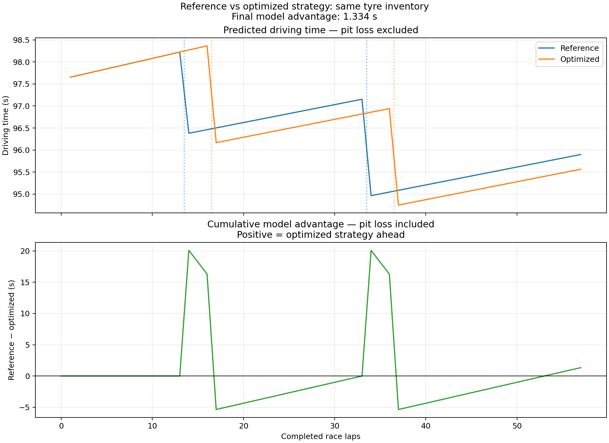

# F1 Race Strategy Optimizer

A C++20 race-strategy optimizer with Python pace-model calibration
and a retrospective case study of Lando Norris's 2024 Bahrain Grand Prix.

The project minimizes predicted race time under explicit modelling
assumptions. It does not claim to identify the best real-world strategy.

## Features

- Deterministic lap-by-lap race simulation.
- Exhaustive strategy enumeration.
- Dynamic programming with unrestricted compound availability.
- Inventory-aware dynamic programming with individual tyre sets
  and initial tyre ages.
- Optimizer checks against brute-force results on synthetic scenarios.
- Joint linear pace calibration and an experimental Gaussian
  state-space model with Kalman filtering.
- Chronological forecast validation.
- Pit-loss sensitivity analysis and CSV/plot exports.

## Case-study results

The example inventory contains one SOFT set with initial age 3
and two fresh HARD sets. These are the sets represented in the
reference strategy, not a verified complete pre-race inventory.

| Strategy | Stint lengths | Model time |
| --- | --- | ---: |
| Reference | SOFT 13 → HARD 20 → HARD 24 | 5542.844 s |
| Best one-stop, example inventory | SOFT 26 → HARD 31 | 5554.564 s |
| Best two-stop, example inventory | SOFT 16 → HARD 20 → HARD 21 | 5541.510 s |

The best inventory-constrained strategy improves model time by
1.334 seconds relative to the reference, assuming a constant
22-second pit loss.

The reference reproduces observed stint boundaries and initial tyre
ages. Its reported time is simulated, not the driver's actual race time.



## Quick start

Requirements:

- C++20 compiler.
- CMake 4.0 or newer.
- Python 3.9 or newer for calibration, Python tests and plotting.

Run all commands from the repository root.

### Build and test C++

```bash
cmake -S . -B build -DCMAKE_BUILD_TYPE=Release
cmake --build build --parallel
ctest --test-dir build --output-on-failure
```

### Run with the included calibrated configuration

```bash
./build/f1_race_strategy_optimizer config/pace_model.txt
```

The executable prints strategy rankings, an inventory-constrained
reference comparison and pit-loss sensitivity results. It also writes:

- `results/reference_laps.csv`
- `results/optimized_laps.csv`

### Refit the pace models and regenerate outputs

```bash
python3 -m venv .venv
.venv/bin/python -m pip install -r pace_modeling/requirements.txt

.venv/bin/python pace_modeling/run_analysis.py --input data/processed/bahrain_2024/pace_laps.csv
.venv/bin/python -m unittest discover -s pace_modeling -p 'test_*.py'
.venv/bin/python pace_modeling/export_cpp_config.py

./build/f1_race_strategy_optimizer config/pace_model.txt
.venv/bin/python plot_strategy_comparison.py
```

The included processed lap table supports this workflow without
downloading data again. Earlier data-ingestion and exploratory scripts
are retained separately from this main workflow.

## Pace model

The deterministic simulator uses:

```text
lap_time =
    base_time[compound]
    + degradation[compound] * tyre_age
    - race_lap_gain * (race_lap - 1)
```

The two compound baselines, two degradation coefficients and shared
race-lap gain are estimated jointly using least squares.

`race_lap_gain` is an empirical trend. It can absorb fuel effects,
track evolution and changes in driving behaviour; it is not a
measurement of the isolated fuel effect.

The C++ field currently named `fuel_gain_s_per_lap` stores this
empirical race-lap trend.

For simulation, `tyre_age` means age at the start of the current lap.
In the input dataset, the column named `tyre_age_at_start` instead
describes age at the start of the stint; calibration uses `tyre_age`.

## Forecast validation

The case study selects 39 valid Norris laps with a minimum observed
gap of at least 2 seconds: 7 SOFT laps and 32 HARD laps.

Models are trained on 28 selected observations through race lap 40.
The remaining 11 selected observations, laps 41–51, are held out.

| Method | Test MAE |
| --- | ---: |
| Joint linear model, fixed forecast | 0.1944 s |
| State-space model, fixed forecast | 0.1944 s |
| State-space model, online updates | 0.1944 s |
| Training-stint mean, fixed baseline | 0.3800 s |
| Previous observed lap, online baseline | 0.1193 s |

Online predictions may use earlier observed test laps. Fixed forecasts
do not. The two protocols therefore use different information sets.

The state-space model's fitted process variance was nearly zero on
the training prefix, so it behaved almost like the linear model.
It did not demonstrate an advantage on this validation split.

Full-data coefficients used in the retrospective strategy experiment
are exported separately from the training-only validation coefficients.

See [pace modelling notes](pace_modeling/README.md) for details.

## Optimization

The unrestricted optimizer tracks race progress, stint count and
compound usage. The inventory-aware variant additionally tracks
which individual tyre sets have been used.

Both optimize additive stint costs and reconstruct a strategy.
Brute-force enumeration provides a reference for correctness checks.

The executable demonstrates one-stop and two-stop comparisons.
The current dry-tyre model supports SOFT and HARD and requires both
compounds to appear in a feasible strategy.

## Assumptions and limitations

- This is one retrospective race case study.
- Model validation covers the end of the third HARD stint only;
  it does not establish SOFT or new-stint forecast accuracy.
- SOFT calibration uses only seven observations at tyre ages 7–14.
  Longer SOFT strategies extrapolate beyond that observed range.
- Traffic filtering is based on observed gaps and does not guarantee
  completely unaffected laps.
- Pit loss is constant and charged on the first lap of each new stint.
  This is an accounting convention, not a detailed pit-lap model.
- Traffic, overtaking, safety cars, weather, tyre warm-up and nonlinear
  degradation are not simulated.
- Tyre-set order is free within the example inventory.
- No additional maximum tyre-age constraint is imposed.
- Additive race-lap gain contributes the same total to every strategy
  covering all race laps; strategy ranking depends on tyre costs and stops.
- Equal-cost permutations can occur because this model does not include
  interactions between stint order and race conditions.
- Parameter uncertainty has not been propagated into strategy rankings.
  The 1.334-second model advantage is not evidence of a real-world gain.

## Main files

| File | Responsibility |
| --- | --- |
| `race_types.hpp` | Shared data structures |
| `race_model.cpp` | Lap prediction and simulation |
| `brute_force.cpp` | Strategy enumeration |
| `dynamic_programming.cpp` | Dynamic-programming optimizers |
| `config_io.cpp` | Pace-parameter loading |
| `results_io.cpp` | Simulation CSV export |
| `optimizer_tests.cpp` | Optimizer correctness checks |
| `main.cpp` | Case-study execution |
| `pace_modeling/run_analysis.py` | Calibration and forecast validation |
| `pace_modeling/export_cpp_config.py` | Python-to-C++ parameter export |
| `plot_strategy_comparison.py` | Strategy comparison plot |

## Data and research reference

The historical data used in this project originates from OpenF1:
https://openf1.org/docs/

The experimental state-space implementation is inspired by:

Cappello and Hoegh, *A State-Space Approach to Modeling Tire
Degradation in Formula 1 Racing* (2025):
https://arxiv.org/abs/2512.00640

This project uses a Gaussian Kalman-filter likelihood implementation;
it does not reproduce the paper's Bayesian Stan/MCMC analysis.